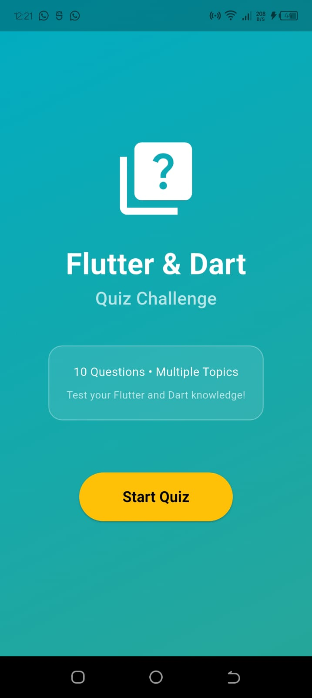
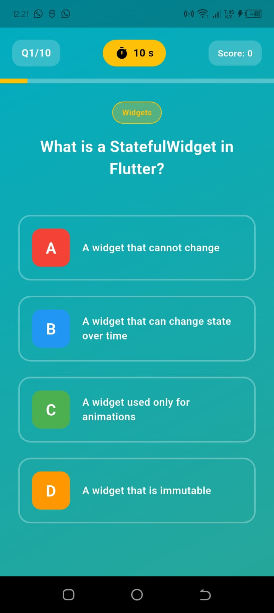
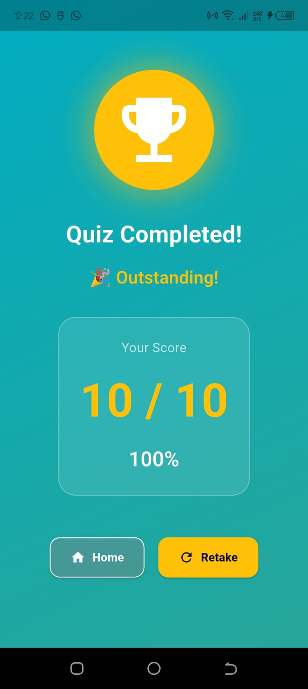

# 🎯 Flutter & Dart Quiz Kahoot

A beautifully designed, interactive quiz application built with Flutter using **MVVM Architecture** to help beginners learn Flutter, Dart, and mobile development concepts in a fun and engaging way.

## ✨ Features

- **10 Comprehensive Questions** covering:
  - StatefulWidget & Widget Lifecycle
  - Dart Programming Language
  - Layout Widgets (Column, Row, ListView, GridView)
  - BuildContext and State Management
  - Beginner-friendly content

- **Interactive Kahoot-Style UI**
  - Vibrant cyan and teal gradient backgrounds
  - Colorful option buttons (A, B, C, D) with visual feedback
  - Smooth animations and transitions
  - Category badges for each question
  - Real-time score tracking
  - Progress bar visualization

- **Dynamic Timer System**
  - 15-second countdown per question
  - Visual warning when time is running low (red timer)
  - Auto-advance to next question after answer
  - Pause and resume functionality

- **Instant Feedback**
  - Green highlight for correct answers with checkmark
  - Red highlight for incorrect answers with X mark
  - 2-second delay before moving to next question
  - Animated feedback messages

- **Results Screen**
  - Final score display with percentage
  - Performance-based motivational messages:
    - 🎉 "Outstanding!" (80%+)
    - 👍 "Good Job!" (60-79%)
    - 💪 "Keep Practicing!" (<60%)
  - Trophy icon celebration animation
  - Options to retake quiz or return home

- **Responsive Design**
  - Works seamlessly on different screen sizes
  - Safe area handling for notched devices
  - Touch-friendly buttons and interactions
  - Portrait orientation optimization

- **MVVM Architecture**
  - Clean separation of concerns
  - Testable business logic
  - Reusable widgets and components
  - Easy to extend and maintain

## 🏗️ Architecture

This project implements **MVVM (Model-View-ViewModel)** architecture:

```
Model Layer
    ↓
Question (Data)
    ↓
ViewModel Layer
    ↓
QuizViewModel (Business Logic & State)
    ↓
View Layer
    ↓
Screens & Widgets (UI)
```

### Project Structure
```
lib/
├── main.dart                          # App entry point
├── models/
│   └── question.dart                 # Question data model
├── viewmodels/
│   └── quiz_viewmodel.dart          # Business logic & state management
├── views/
│   ├── screens/
│   │   ├── home_screen.dart         # Welcome screen
│   │   ├── quiz_screen.dart         # Quiz gameplay
│   │   └── result_screen.dart       # Results display
│   └── widgets/
│       ├── quiz_header.dart         # Header component
│       ├── question_widget.dart     # Question display
│       ├── option_button.dart       # Answer options
│       └── feedback_widget.dart     # Feedback indicator
├── routes/
│   └── app_routes.dart              # Navigation management
└── providers/
    └── change_notifier_provider.dart # State management
```

## 📱 Screenshots

### Home Screen
<p align="center">
  
 </p>

### Quiz Screen
<p align="center">
  
  </p>

### Results Screen
<p align="center">
  
  </p>

## 🚀 Getting Started

### Prerequisites

- Flutter SDK (version 3.0 or higher)
- Dart SDK
- Android Studio / Xcode / Visual Studio Code
- Android emulator or iOS simulator (or physical device)

### Installation

1. **Clone the repository:**
   ```bash
   git clone https://github.com/jude-craft/flutter-dart-quiz.git
   cd flutter-dart-quiz
   ```

2. **Install dependencies:**
   ```bash
   flutter pub get
   ```

3. **Run the app:**
   ```bash
   flutter run
   ```

   Or for a specific device:
   ```bash
   flutter run -d <device-id>
   ```

## 🎮 How to Play

1. **Start Quiz**: Tap the "Start Quiz" button on the home screen
2. **Read Question**: Each question includes a category badge (Widgets, Dart, Layouts)
3. **Select Answer**: Choose from 4 color-coded options (A=Red, B=Blue, C=Green, D=Orange)
4. **Get Feedback**: Instantly see if your answer is correct or wrong
5. **Next Question**: Automatically proceeds after 2 seconds
6. **View Results**: See your final score and performance message
7. **Retake Quiz**: Option to restart and improve your score
8. **Home**: Return to home screen

## 📚 Learning Concepts

This project is designed to teach and demonstrate:

### StatefulWidget Concepts
- Creating a StatefulWidget class
- Overriding `createState()` method
- Understanding the `State` class lifecycle
- Using `setState()` to rebuild widgets
- Implementing `initState()` for initialization
- Using `dispose()` for cleanup

### MVVM Architecture
- Separating business logic from UI
- Using ChangeNotifier for state management
- Implementing Provider pattern
- Creating reusable components
- Managing state through ViewModels

### State Management
- Managing multiple state variables
- Updating UI based on state changes
- Handling widget lifecycle
- Notifying listeners of changes

### Flutter Fundamentals
- Building responsive layouts
- Using gradient backgrounds
- Creating custom button styles
- Implementing animations
- Working with timers
- Navigation between screens
- Using Material Design widgets

### Dart Concepts
- Using classes and inheritance
- List data structures and iteration
- String interpolation
- Lambda functions and callbacks
- Type safety and generics
- ChangeNotifier and listeners
- Private variables (underscore prefix)

## 🎯 Quiz Topics Breakdown

### Widgets (4 questions)
- What is a StatefulWidget?
- initState() and setState() methods
- dispose() cleanup functionality
- BuildContext purpose

### Dart Programming (2 questions)
- Dart data types
- Futures and asynchronous programming

### Layouts (3 questions)
- Column widget for vertical arrangement
- Row widget for horizontal arrangement
- ListView for scrolling content

### General Flutter (1 question)
- Flutter knowledge fundamentals

## 🎨 Customization Guide

### Change Background Color
Edit the gradient colors in screen files:
```dart
LinearGradient(
  begin: Alignment.topLeft,
  end: Alignment.bottomRight,
  colors: [Colors.cyan.shade600, Colors.teal.shade400],
)
```

Popular color combinations:
- **Orange & Pink**: `Colors.orange.shade600` → `Colors.pink.shade400`
- **Green & Lime**: `Colors.green.shade700` → `Colors.lime.shade400`
- **Red & Orange**: `Colors.red.shade600` → `Colors.orange.shade400`

### Add More Questions
Edit `lib/viewmodels/quiz_viewmodel.dart` - Add to the `questions` list:
```dart
Question(
  questionText: 'Your question here?',
  options: ['Option A', 'Option B', 'Option C', 'Option D'],
  correctAnswerIndex: 0, // Index of correct answer
  category: 'Category Name',
),
```

### Adjust Timer Duration
Edit `lib/viewmodels/quiz_viewmodel.dart` - Change in `startTimer()`:
```dart
void startTimer() {
  _timeLeft = 20; // Change from 15 to 20 seconds
}
```

### Modify Option Colors
Edit `lib/viewmodels/quiz_viewmodel.dart`:
```dart
final List<Color> optionColors = [
  Colors.red,
  Colors.blue,
  Colors.green,
  Colors.orange,
];
```

## 📦 Dependencies

This project uses only Flutter's built-in packages. **No external dependencies required!**

```yaml
dependencies:
  flutter:
    sdk: flutter
```

**Optional**: To use the official `provider` package instead of custom implementation, add to `pubspec.yaml`:
```yaml
dependencies:
  provider: ^6.0.0
```

Then update imports in files using Provider.

## 🧪 Testing the App

### Manual Testing Checklist
- [ ] Home screen loads correctly
- [ ] Start Quiz button navigates to quiz screen
- [ ] Timer counts down correctly
- [ ] Questions display properly
- [ ] Selecting answer highlights correctly
- [ ] Correct answers show green checkmark
- [ ] Wrong answers show red X mark
- [ ] Score increments correctly
- [ ] Progress bar updates
- [ ] Quiz completes after 10 questions
- [ ] Results screen shows correct score and percentage
- [ ] Retake Quiz button restarts quiz
- [ ] Home button returns to home screen

### Unit Testing (Coming Soon)
```dart
test('QuizViewModel initializes correctly', () {
  final viewModel = QuizViewModel();
  expect(viewModel.score, 0);
  expect(viewModel.currentQuestionIndex, 0);
});
```

## 🤝 Contributing

Contributions are welcome! To contribute:

1. Fork the repository
2. Create a feature branch (`git checkout -b feature/NewFeature`)
3. Commit your changes (`git commit -m 'Add NewFeature'`)
4. Push to the branch (`git push origin feature/NewFeature`)
5. Open a Pull Request

### Ideas for Contributions
- Add more question categories
- Implement difficulty levels (Easy, Medium, Hard)
- Create a high score leaderboard with local storage
- Add category selection before starting quiz
- Implement sound effects and haptic feedback
- Create a review screen showing all answers with explanations
- Add dark mode support
- Implement question randomization
- Add streak tracking
- Create multiplayer functionality

## 📄 License

This project is licensed under the MIT License - see the LICENSE file for details.

```
MIT License

Permission is hereby granted, free of charge, to any person obtaining a copy
of this software and associated documentation files (the "Software"), to deal
in the Software without restriction...
```

## 👨‍💻 Author

- **Your Name** - Initial work and MVVM implementation
- **GitHub**: [your-github-profile](https://github.com/yourusername)
- **Email**: your-email@example.com

## 🙏 Acknowledgments

- [Flutter Documentation](https://flutter.dev/docs) - Official Flutter guides
- [Dart Language](https://dart.dev) - Dart programming resources
- [Material Design](https://material.io/design) - Design guidelines
- Flutter community for feedback and suggestions

## 📞 Support

If you have any questions, issues, or suggestions:

- **Open an Issue** on GitHub
- **Email**: derekjude254@gmail.com

## 📚 Learning Resources

### Flutter & Dart
- [Flutter Official Documentation](https://flutter.dev/docs)
- [Dart Language Tour](https://dart.dev/guides/language/language-tour)
- [Flutter Widgets Catalog](https://flutter.dev/docs/development/ui/widgets)
- [Effective Dart Guide](https://dart.dev/guides/language/effective-dart)

### Architecture & Design Patterns
- [MVVM Pattern Explanation](https://en.wikipedia.org/wiki/Model%E2%80%93view%E2%80%93viewmodel)
- [Provider Pattern](https://pub.dev/packages/provider)
- [State Management Guide](https://flutter.dev/docs/development/data-and-backend/state-mgmt/intro)

### Best Practices
- [Flutter Best Practices](https://flutter.dev/docs/testing/best-practices)
- [Dart Style Guide](https://dart.dev/guides/language/effective-dart/style)
- [Flutter Code Organization](https://flutter.dev/docs/development/best-practices/testing)

## 🐛 Troubleshooting

### Common Issues

**Issue**: App crashes on startup
- **Solution**: Run `flutter pub get` to install dependencies

**Issue**: Timer doesn't work
- **Solution**: Check that `disposeTimer()` is called in `dispose()` method

**Issue**: Navigation not working
- **Solution**: Verify all routes are defined in `AppRoutes` class

**Issue**: State not updating
- **Solution**: Ensure `notifyListeners()` is called after state changes

**Issue**: Build errors
- **Solution**: Run `flutter clean` then `flutter pub get`

## 🚀 Performance Tips

- Questions are pre-loaded in memory
- Animations use optimized duration (500ms)
- Timer updates UI efficiently
- No unnecessary rebuilds with Consumer pattern
- Proper resource cleanup in dispose()

## 📊 Metrics

- **Total Questions**: 10
- **Timer Duration**: 15 seconds per question
- **Feedback Delay**: 2 seconds
- **Animation Duration**: 500ms
- **Minimum Flutter Version**: 2.0
- **Supported Platforms**: iOS, Android, Web

---

## 📝 Version History

### v1.0.0 (Current)
- Initial release
- 10 questions on Flutter & Dart
- MVVM architecture
- Custom state management
- Interactive UI with animations
- Results tracking

---

**Made with ❤️ by Jude**

**Happy Learning! 🚀**